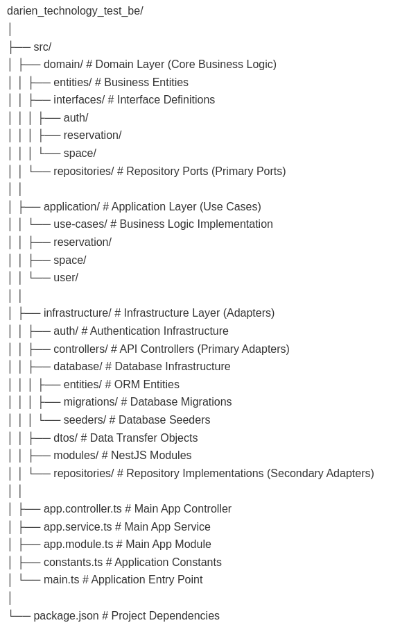

# Reservation System Application

A full-stack application designed for Reservation System, built with React + Vite and Node.js + Nestjs.

## 🚀 Tech Stack

### Frontend

- React.js with Vite
- Tailwind CSS for styling
- React Router for navigation
- React Context for state management

### Backend

- Node.js
- Nestjs

#### Arquitecture

For this it was used hexagonal architecture, with the following layers:

#### Testing

It was used Jest for unit testing. To run the unit tests, it can be used the following command:

First of all, the packages need to be installed:

`yarn install`

Then, the tests can be run with the following command:

`yarn run test`

Or run the following command to see the coverage of the tests:

`yarn run test:cov`

### Database

- MySQL as a database.
- TypeORM as an ORM.

## ⚙️ Prerequisites

- Docker and docker-compose installed.

## 🛠️ Installation

1. Clone the repository
2. Run `docker-compose up --build -d` create the containers and run the application.
3. Go to `http://localhost:5173` to see the application.

## 📚 Documentation

It can be found the backend API documentation after running the application on this link:
http://localhost:3000/api/

## Notes

### Default users

The default users to login are:

- email: user1@example.com
- password: password123

- email: user2@example.com
- password: password123
